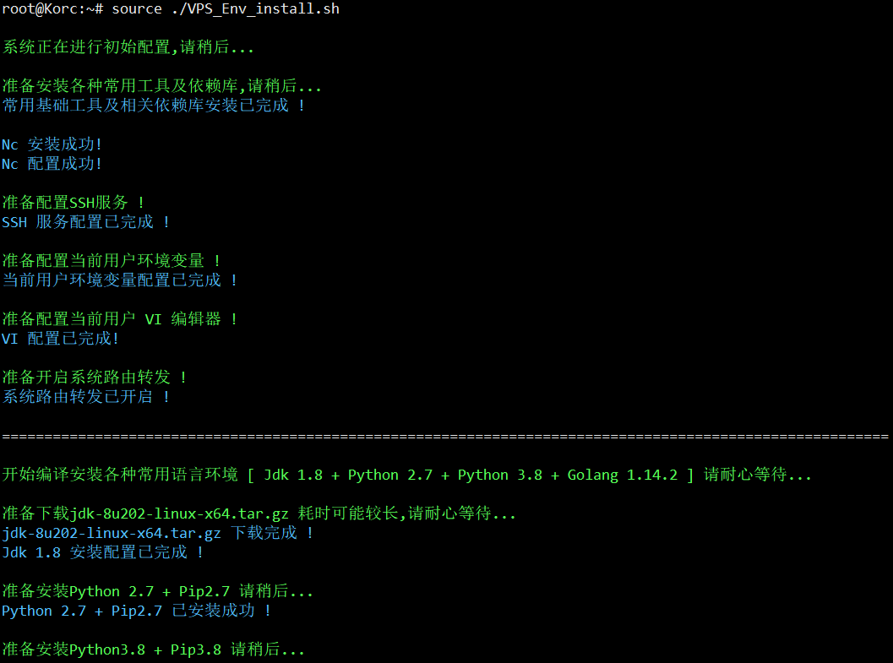
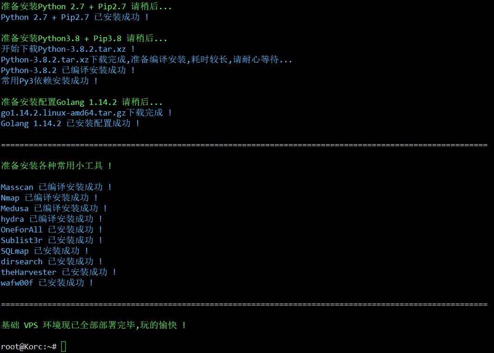

### 0x01 VPS 初始化操作 [ Tested On Ubuntu 16.04 LTS 64bit ]
```
# passwd
# echo "Korc" > /etc/hostname
# echo 127.0.0.1 Korc >> /etc/hosts
# shutdown -r now
```

### 0x02 执行脚本 [ 用source执行 ]
```
# source ./VPS_Env_install.sh
```

### 说明
```
渗透的VPS可能换的比较勤,脚本的作用就是将平时经常会用到的一些
"系统依赖库" "各类语言执行环境(python2/3 + Golang + JDK)"  及 "小工具" 自动安装配置,避免重复劳动
```

### 实际效果


